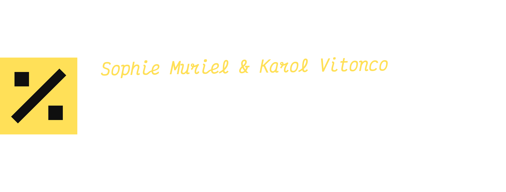
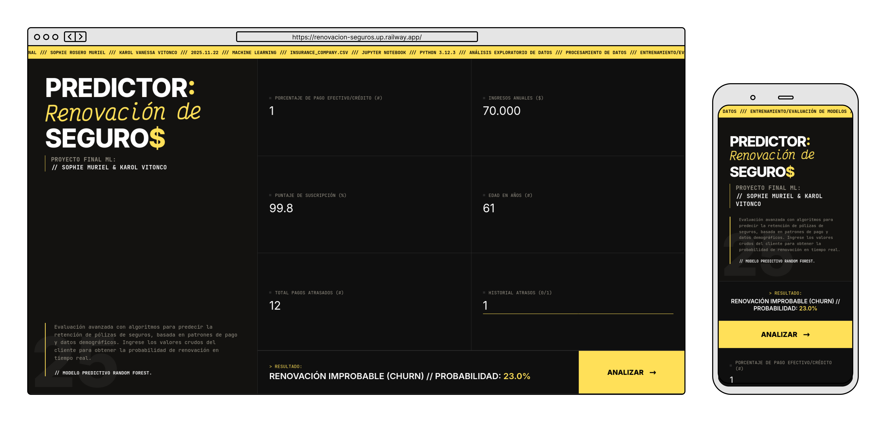

<div style="text-align: center;">

# > PROYECTO FINAL ML <



<div style="display:flex; justify-content:center; align-items:flex-start; gap:1rem; max-width:100%;">
    
</div>


<br />


***SISTEMA DE PREDICCIÓN DE RETENCIÓN DE PÓLIZAS DE SEGUROS.***

</div>

## ⚡ APP WEB // DEMO EN VIVO

Este proyecto opera como una aplicación web en Flask para inferencia en tiempo real.
La instancia de producción está desplegada estáticamente en **Railway**.

**🔗 ACCESO AL SISTEMA** > **[https://proyectofinal-muriel-vitonco-production.up.railway.app/](https://proyectofinal-muriel-vitonco-production.up.railway.app/)**

## ⚠️ NOTA: ARCHIVOS EXTERNOS

Para optimizar el repositorio, los archivos binarios pesados (`.pkl`) **NO** están alojados aquí.

- **Origen:** Se generan automáticamente en la `[SECCIÓN 10]` del Jupyter Notebook durante su ejecución.
- **Runtime:** Durante el despliegue, el sistema descarga automáticamente los modelos desde **Hugging Face Hub**.

| ARCHIVO                       | TIPO                   | ENLACE                                                                                                            |
| :---------------------------- | :--------------------- | :---------------------------------------------------------------------------------------------------------------- |
| `insurance_renewal_model.pkl` | Modelo (Random Forest) | [Hugging Face Repo](https://huggingface.co/sophie-muriel/insurance-renewal/blob/main/insurance_renewal_model.pkl) |
| `scaler.pkl`                  | Scaler (MinMax)        | [Hugging Face Repo](https://huggingface.co/sophie-muriel/insurance-renewal/blob/main/scaler.pkl)                  |

## 🧭 ÍNDICE // NAVEGACIÓN

1.  [DETALLES DEL PROYECTO](#-detalles-del-proyecto)
2.  [SISTEMA DE ARCHIVOS](#-sistema-de-archivos)
3.  [INICIALIZACIÓN](#-inicialización)
4.  [PROTOCOLOS DE EJECUCIÓN](#-protocolos-de-ejecución)
5.  [CONCLUSIONES GENERALES](#-conclusiones-generales)
6.  [AUTORES](#-autores)

## 📘 DETALLES DEL PROYECTO

Este repositorio busca analizar patrones de comportamiento en el pago de pólizas de seguros para calcular la probabilidad de renovación, tomando información de dataset proporcionado (`insurance_company.csv`). El flujo de trabajo abarca desde la ingesta de datos crudos hasta el despliegue de inferencia.

**/// COMPONENTES DEL NOTEBOOK.IPYNB:**

- `CASO DE NEGOCIO`: Introducción, identificación del problema (retención de clientes y su impacto financiero), datos, objetivos y variables (dependiente/independiente).
- `DESCRIPCIÓN`: Carga de librerías/datos e información general del dataset y sus variables.
- `EDA`: Análisis exploratorio (con detección de patrones y outliers) y Data Profiling.
- `PREPROCESSING`: Limpieza, codificación, imputación, normalización y transformación de variables.
- `MODELING`: Entrenamiento y evaluación de modelos (Random Forest, KNN, Regresión Logística).
- `RECOMENDACIONES`: Conclusiones finales y acciones sugeridas para mejorar la retención y optimizar los esfuerzos comerciales.
- `DEPLOYMENT`: API Flask + Frontend estilizado hosteado en **Railway**.

## 📂 SISTEMA DE ARCHIVOS

```text
PROYECTOFINAL-MURIEL-VITONCO/
│
├── data/                                    # [DATASET INPUT/OUTPUT]
│   ├── crosstabs/
│   ├── grouped_describe_by_renewal_cat.csv
│   ├── grouped_describe_by_renewal_num.csv
│   ├── insurance_company.csv
│   └── insurance_company_final.csv
│
├── images/                                  # [VISUALIZATION OUTPUTS]
│   ├── univariable/
│   ├── bivariable/
│   ├── models/
│   ├── corr_matrix_filtered.png
│   ├── corr_matrix.png
│   ├── renewal_dist.png
│   └── renewal_smote_dist.png
│
├── static/                                  # [ESTILOS FRONTEND]
│   ├── css/styles.css
│   ├── favicon.svg
│   ├── header.png
│   └── mockups.png
│
├── templates/                               # [INTERFAZ WEB]
│   └── index.html
│
├── app.py                                   # [BACKEND FLASK]
├── notebook.ipynb                           # [NOTEBOOK]
├── reporte_eda_profiling.html               # [REPORTE YDATA-PROFILING]
├── presentation.pdf                         # [PRESENTACIÓN]
├── .python-version                          # [VERSIÓN DE PYTHON]
├── requirements.txt                         # [DEPENDENCIAS]
└── README.md                                # < USTED ESTÁ AQUÍ >
```

### 📝 DESCRIPCIÓN GENERAL

- `data/`: Datasets original/transformado y tablas estadísticas generadas durante el EDA.
- `images/`: Visualizaciones producidas en el análisis (univariado, bivariado, correlaciones y gráficos del modelo).
- `static/`: Estilos CSS, imágenes de mockups e ícono del sitio web.
- `templates/`: Plantilla HTML para la aplicación web (`index.html`).
- `app.py`: Archivo principal del servidor Flask, manejo de rutas, carga del modelo y predicciones.
- `notebook.ipynb`: EDA, transformación de datos, entrenamiento, evaluación de modelos, recomendaciones.
- `reporte_eda_profiling.html`: Reporte automático generado con YData-Profiling.
- `requirements.txt`: Lista de dependencias necesarias para reproducir el proyecto.

## 🛠️ INICIALIZACIÓN

**REQUISITOS DEL SISTEMA:**

- Python 3.9+
- pip
- Entorno Virtual (Recomendado)
- Navegador web
- Dependencias:
  - pandas
  - numpy
  - matplotlib
  - seaborn
  - ydata-profiling
  - scipy
  - imbalanced-learn
  - scikit-learn
  - flask
  - ipykernel
  - ipywidgets
  - huggingface_hub
  - gunicorn

**INSTALACIÓN DE DEPENDENCIAS:**

```bash
pip install -r requirements.txt
```

## 🚀 PROTOCOLOS DE EJECUCIÓN

### 1. CLONAR REPOSITORIO

```bash
git clone https://github.com/sophie-muriel/ProyectoFinal-Muriel-Vitonco.git
cd ProyectoFinal-Muriel-Vitonco
```

### 2. CONFIGURAR ENTORNO VIRTUAL (RECOMENDADO)

```bash
# Windows
python -m venv .venv
.venv\Scripts\activate

# Linux / macOS
python3 -m venv .venv
source .venv/bin/activate
```

### 3.INSTALAR DEPENDENCIAS

```bash
pip install -r requirements.txt
```

### 4. EJECUTAR NOTEBOOK

Para regenerar el análisis completo y re-entrenar los modelos localmente:

```bash
jupyter notebook
# Ejecutar todas las celdas de 'notebook.ipynb'
```

### 5. INICIAR APP FLASK LOCALMENTE (INFERENCIA)

```bash
python app.py
```

_El servidor iniciará en `http://localhost:8080`._

### 6. ... O IR AL DEMO EN VIVO

Justo aquí > [PREDICTOR // RENOVACIÓN](#-app-web--demo-en-vivo)

## 📊 CONCLUSIONES GENERALES

> \*El objetivo principal fue: **¿Qué factores influyen en la propensión a renovar primas de seguros, y cómo se puede preparar el dataset, modelar y evaluar para predecir esta probabilidad y optimizar incentivos?\***

El modelo final (**Random Forest**) se seleccionó tras el EDA, Data Preprocessing y pruebas comparativas entre múltiples modelos, principalmente debido a su capacidad para manejar el desbalance de clases (~6.3% Churn Rate). Este modelo presenta una alta capacidad de diferenciación entre clientes que renuevan vs. no renuevan.

**> STATUS DEL MODELO:**

- **Variable Objetivo:** Renovación (Binaria); `renewal`.
- **Prioridad:** Maximizar `Recall` en clase minoritaria (No Renovación).
- **Métricas excelentes**: Precisión alta, F1-score balanceado, ROC-AUC sólido con buena separación entre clases, etc.

> _Los valores exactos pueden consultarse en la `[SECCIÓN 8.2]` del Jupyter Notebook._

**> VARIABLES DE ALTO IMPACTO:**

1. `perc_premium_paid_by_cash_credit`
2. `income`
3. `application_underwriting_score`
4. `age_in_years`
5. `total_late_payments`
6. `has_late_payments` (Historial)

Para consultar la totalidad del análisis, se incluye en el repositorio el archivo `presentation.pdf`. Estas diapositivas contienen el resumen completo del proyecto, la metodología detallada, los hallazgos visuales y las conclusiones estratégicas finales. Se recomienda su revisión para una comprensión integral del caso de negocio y los hallazgos encontrados.

## 👥 AUTORES

Hecho por:

- **Sophie Muriel** > [PERFIL DE GITHUB](https://github.com/sophie-muriel)
- **Karol Vitonco** > [PERFIL DE GITHUB](https://github.com/KrlVanessa)
